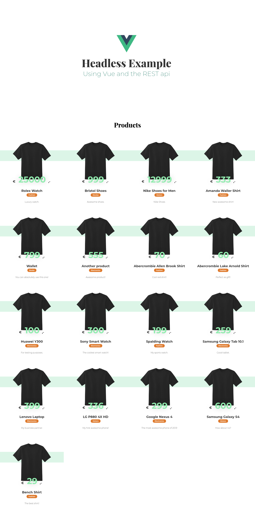

# Vue Storefront Example
An example Storefront using Vue and the REST api to get category- and productdata from the database and showing the data on the front-end.
The REST api will be set up via PHP.

Will be used for educational purposes.

Contains two directories:
- `api`
- `storefront`

### api
The `api` directory contains the REST api. Here the api URL's are created and the database connection are made.
The following functionalities can be used:
- `/create.php`: Can be used to create a product. Will need additional data, for example:
`{
    "name" : "Amazing Pillow 2.0",
    "price" : "199",
    "description" : "The best pillow for amazing programmers.",
    "category_id" : 2,
    "created" : "2018-06-01 00:35:07"
}`
- `/delete.php`: Can be used to delete a product. Will need additional data, for example:
`{
    "id" : "106"
}`
- `/read.php`: Can be used to get a list of all products.
- `/read_single.php?id=1`: Can be used to get a single product, based on the id given in the query.
- `/update.php`: Can be used to change product data. Will need additional data, for example:
`{
    "id" : "106",
    "name" : "Amazing Pillow 3.0",
    "price" : "255",
    "description" : "The best pillow for amazing programmers.",
    "category_id" : 2,
    "created" : "2018-08-01 00:35:07"
}`

## storefront
Run using: `npm run serve`

A Vue application running a dummy storefront:

